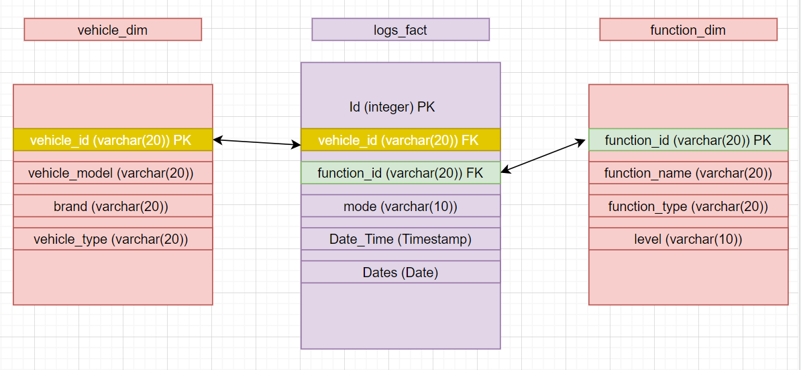

# Uber Take Home Exercise
## Topics
### 1)	Idea behind the ETL model and Assumptions
### 2)  Requirements
### 3)	Steps for Running/Deploying the application

1. Idea behind the ETL model and Assumptions:

a) Data Model:

My data model consists of three tables. Each of these tables have been extracted from the log file provided. The below image explains the column types and relationships between the tables. The Fact table has an ID column as auto increment which is the primary key of the table. The vehicle and function dimensions have their primary keys as vehicle_id and function_id respectively. At this stage I am assuming the dimensions are not slowly changing dimensions but only contain details about the vehicles and functions. I have created the other columns in both the dimensions as examples to show how these dimensions can hold information about the vehicles and functions.

b) Services leveraged:

I have created an ETL process using AWS S3, AWS Redshift and Databricks platforms.
I have used AWS S3 buckets as the source of the data. Databricks clusters are being used to extract and transform the data using python and spark apis. Finally, Redshift for loading the data in a warehouse, that holds the data. The code for the whole process is one single databricks notebook (python/ipynb file). This notebook integrates all the services together using different libraries in python and databricks.
